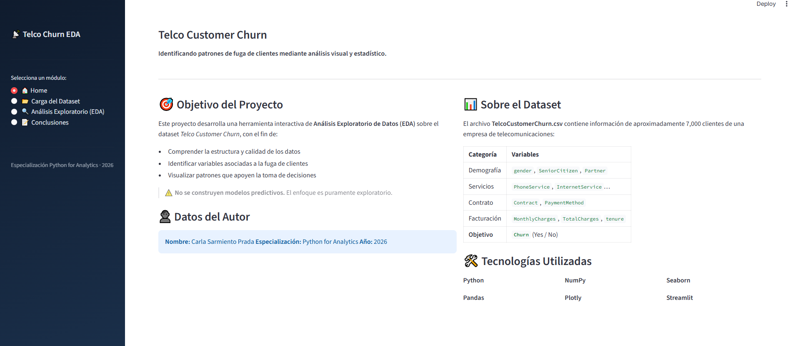
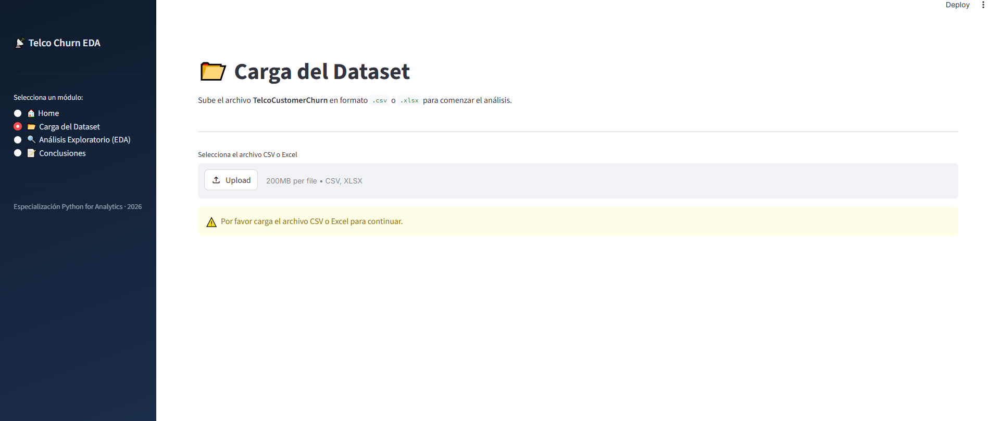
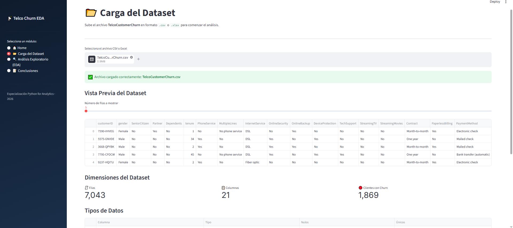
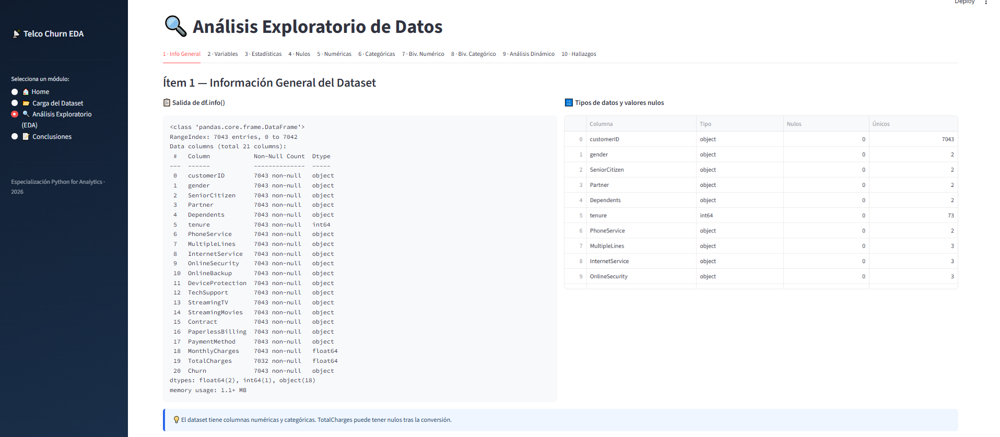
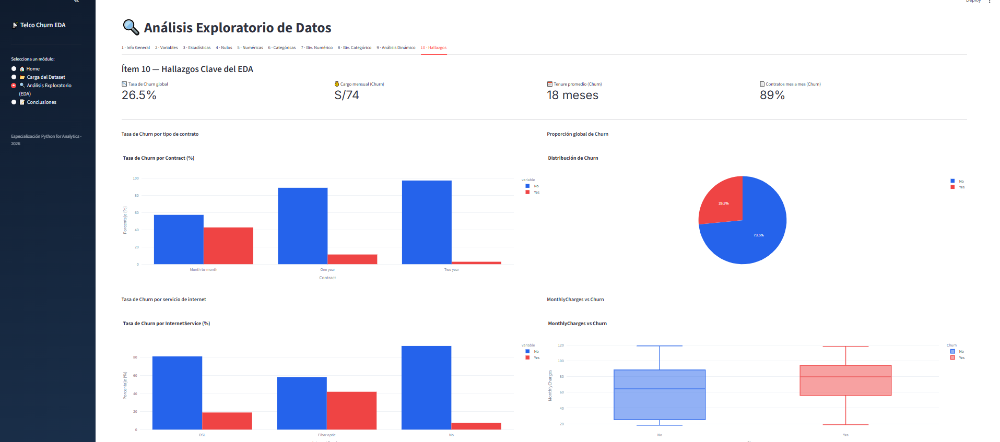
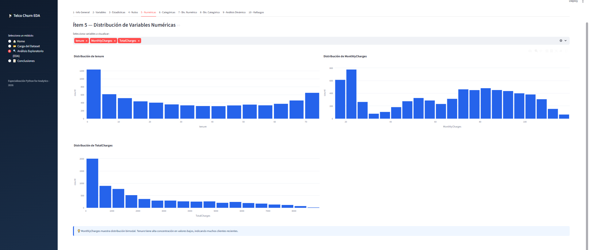

# 📡 Telco Customer Churn — EDA Interactivo

> **Especialización Python for Analytics** · 2026

Aplicación interactiva desarrollada con **Streamlit** para el Análisis Exploratorio de Datos (EDA) del dataset *Telco Customer Churn*, orientada a identificar patrones de fuga de clientes mediante análisis visual y estadístico.

---

## 🎯 Objetivo

Explorar, limpiar, transformar y visualizar los datos para identificar variables y patrones asociados a la fuga de clientes, sin construir modelos predictivos. El proyecto aplica de forma integrada:

- Variables y tipos de datos
- Funciones y f-strings
- Programación Orientada a Objetos (POO)
- NumPy y Pandas
- Visualización con Matplotlib y Seaborn
- Estadística descriptiva

---

## 🗂️ Estructura del Repositorio

```
telco-churn-eda/
│
├── app.py                  # Aplicación principal Streamlit
├── requirements.txt        # Dependencias del proyecto
├── README.md               # Personalizado
├── TelcoCustomerChurn.csv  # Dataset 
└── img                     # Carpeta con Capturas de la app
```


## Capturas de la App









## 🚀 Instrucciones de Ejecución

**1. Clona o descarga el repositorio**
Descarga los archivos del proyecto en tu computadora.

**2. Instala las dependencias**
Abre tu terminal (o Anaconda Prompt) y ejecuta:pip install streamlit pandas numpy matplotlib seaborn plotly openpyxl

**3. Ejecuta la aplicación**
En la misma terminal, escribe: streamlit run app.py

**4. Abre el navegador**
La app se abrirá automáticamente en tu navegador en la dirección: http://localhost:8501

**5. Carga el dataset**
Sube el archivo `TelcoCustomerChurn.csv` o `.xlsx` desde el módulo 📂 Carga del Dataset.

---

## 📋 Módulos de la Aplicación

| Módulo | Descripción |
|--------|-------------|
| 🏠 Home | Presentación del proyecto, autor y tecnologías |
| 📂 Carga del Dataset | Upload de CSV, vista previa y dimensiones |
| 🔍 EDA (10 ítems) | Análisis completo organizado en tabs |
| 📝 Conclusiones | 5 conclusiones técnicas + recomendaciones |

### Ítems del EDA

1. Información general del dataset (`.info()`, nulos)
2. Clasificación de variables (numéricas vs categóricas)
3. Estadísticas descriptivas (media, mediana, moda, asimetría)
4. Análisis de valores faltantes
5. Distribución de variables numéricas (histogramas)
6. Análisis de variables categóricas (barras, proporciones)
7. Análisis bivariado: Numérico vs Churn (boxplot + KDE)
8. Análisis bivariado: Categórico vs Churn (barras apiladas)
9. Análisis dinámico con filtros interactivos
10. Hallazgos clave y visualizaciones resumen

---

## 🛠️ Tecnologías


---

## 🌐 Link relevante

🔗 **[Ver aplicación en Streamlit](https://miaplicaciontrabajo2final-cssp.streamlit.app/)**

---

## 👤 Autor

**Carla Sarmiento Prada**  
Especialización Python for Analytics · 2026
📧 csarmientop31@gmail.com
🔗 [LinkedIn](https://www.linkedin.com/in/carla-sarmiento-prada/)

---

